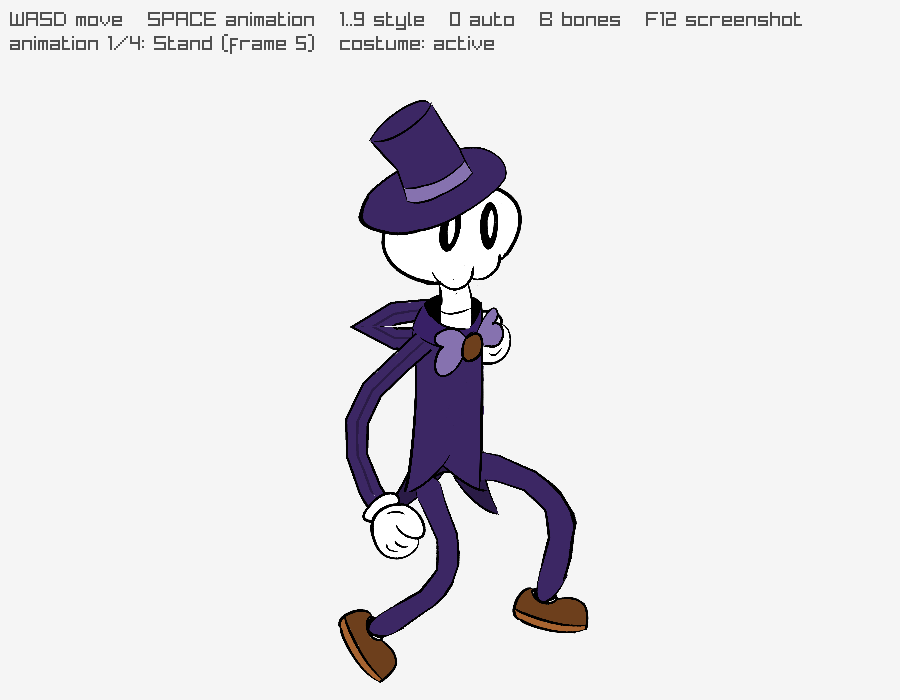
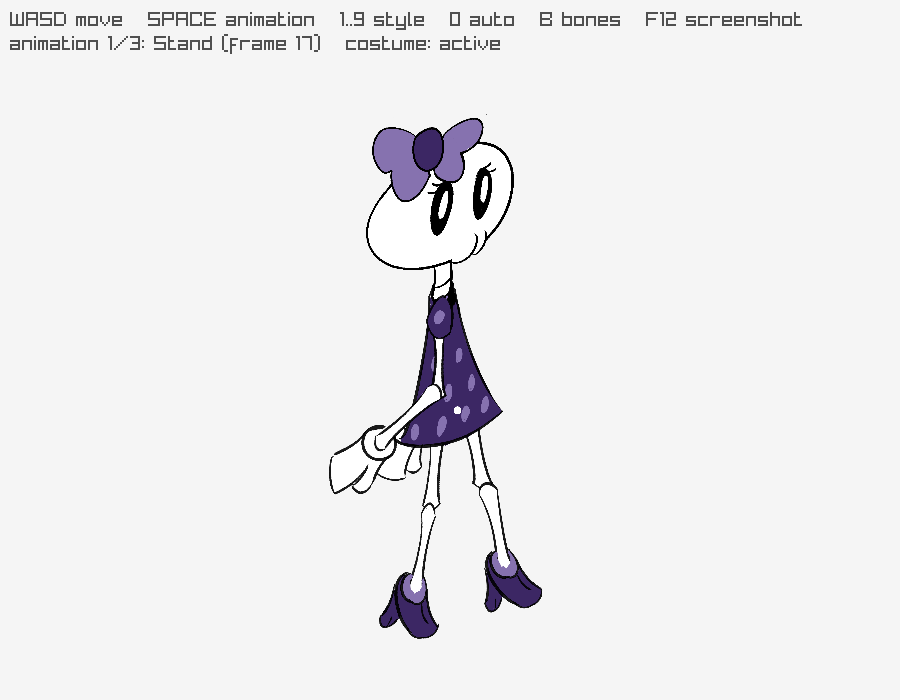
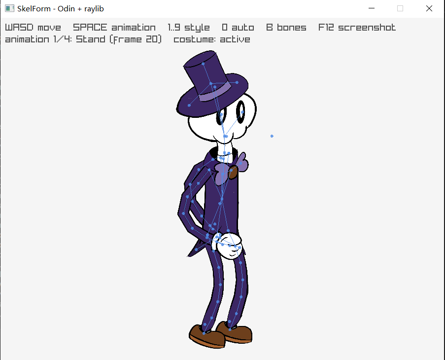
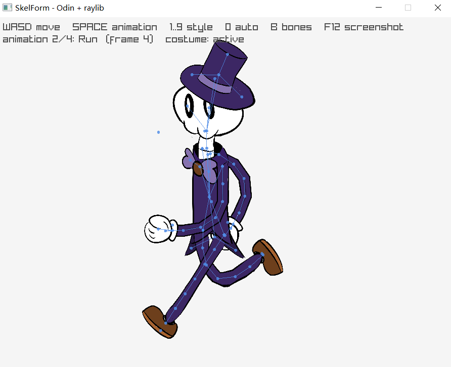

# odin-skelform

A pure-Odin runtime for **SkelForm** 2D skeletal animation, plus a raylib example that loads and
plays exported `.skf` armatures.

Targets **SkelForm 0.8.0** — see [Version compatibility](#version-compatibility).

**English** · [中文](README_zh.md)



## Layout

The repository root **is** the library (`package skelform`); the demo lives next to it. Import it
as `skf` and call it from your own render loop.

The runtime is a line-by-line port of the generic Rust runtime
[`rusty_skelform`](https://github.com/Retropaint/rusty_skelform) v0.8.0, calibrated against the Go
runtime [`skelform_go`](https://github.com/Retropaint/skelform_go). Same types, same field order,
same evaluation order — `skelform.odin` can be diffed against the Rust `src/lib.rs`.

| Path | Contents |
| --- | --- |
| `skelform.odin` | Data model + runtime: animation sampling, inheritance, inverse kinematics, physics, mesh deformation |
| `loader.odin` | `.skf` loading: a small ZIP reader (stored + deflate) and `armature.json` mapping |
| `example/main.odin` | raylib demo: window, input, animation loop |
| `example/render.odin` | raylib glue: screen-space construction and textured drawing |
| `example/*.skf` | Demo armatures (`skellington`, `skellina`) |
| `docs/` | Screenshots used by this README |

## Version compatibility

| Component | Version this port matches |
| --- | --- |
| SkelForm editor (`.skf` exporter) | **0.8.0** |
| `rusty_skelform` (the runtime ported here) | **0.8.0** |
| `rusty_skelform_macroquad` (the adapter `example/render.odin` mirrors) | **0.8.0** |
| `skelform_go` (behaviour cross-checks) | latest |

A `.skf` carries its own format version as the `version` string in `armature.json` — the editor
writes its `CARGO_PKG_VERSION` there. **Neither `rusty_skelform` nor this port reads that field**:
parsing is version-agnostic. The two armatures shipped in `example/` were exported by SkelForm
**0.7.0** and load unchanged.

What that means in practice:

* `loader.odin` maps `armature.json` by hand and applies serde-compatible defaults for anything
  absent, so a file with *extra* keys (a newer editor) loads with those keys dropped rather than
  failing. It never rejects a file for a version mismatch — check `version` yourself if you need to.
* Exports from before **0.6** are *not* handled. The editor upgrades those itself when opening
  (`src/backwards_compat.rs` covers 0.2 → 0.5); runtimes only ever see current-version JSON.
  Re-export old files from the editor instead of feeding them to a runtime.
* Verified against the editor source at `68b66d2` (`Cargo.toml` version `0.8.0`).

## Requirements

* Odin `dev-2026-09-nightly` or newer (developed on `dev-2026-09-nightly:a2fb372`).
* The runtime itself has no C dependency and no third-party Odin dependency: only `core:`
  packages (`core:encoding/json`, `core:compress/zlib`, `core:mem`, …).
* The example additionally needs `vendor:raylib`, which ships with the Odin compiler.

## Using the runtime

Four calls per frame. Everything below is what `example/main.odin` does.

```odin
import skf "path/to/odin-skelform"

// 1) Load the archive exported by the SkelForm editor. Do this once, not per frame.
archive, ok := skf.skf_load("hero.skf")
if !ok {
	return
}
defer skf.skf_destroy(&archive)

armature := &archive.armature

// 2) Sample an animation into the bones. One entry in each slice per playing animation --
//    the runtime supports several animations at once, the example plays just one.
animations := []skf.Animation{armature.animations[0]}
frames := []u32{skf.time_frame(elapsed_seconds, &animations[0], false, true)}
smooth_frames := []u32{20}
skf.animate(
	&armature.bones,
	&armature.inverse_kinematics,
	&armature.visuals,
	animations,
	frames,
	smooth_frames,
)

// 3) Build the skeleton: constructed bone transforms plus deformed meshes.
skf.construct(armature)

// 4) Draw `armature.constructed_bones` and `armature.visuals` with your own renderer.
```

Step 4 is the only part the library deliberately does not provide. `example/render.odin` is the
raylib version: it flips the armature into raylib's Y-down screen space and emits every bone —
mesh or sprite quad — as rlgl triangles. Copy it into a project and adapt it, or call it directly
(see [Running the example](#running-the-example)).

Two things to know before drawing:

* The atlas PNGs come back as raw bytes in `archive.atlases`, in the same order as
  `armature.atlases`; `Texture.atlas_idx` selects which atlas a bone samples. Upload them to
  textures yourself.
* Textures are looked up per **style** (costume). Pass only the worn styles to the draw step; a
  style that has no entry for a texture, or only a 1×1 one, hides that part. `skf.active_styles`
  returns the armature's own selection.

## Running the example

```sh
odin run example                        # windowed, uses example/skellington.skf
odin run example -- example/skellina.skf
```

Or build it once and run the exe — it also finds the armatures relative to its own directory, so
`build/example.exe` works from anywhere:

```sh
odin build example -out:build/example.exe
./build/example.exe
```

The window is 900×700 and the HUD lists the live controls.



| Key | Action |
| --- | --- |
| `A` / `D` | Walk left / right. The facing direction follows the last horizontal key. |
| `W` / `S` | Move up / down |
| `SPACE` | Cycle to the next animation |
| `1` … `9` | Wear that single costume (style) |
| `0` | Go back to the armature's active costume set |
| `B` | Toggle the bone overlay: a line per bone-to-parent link, a dot per joint, hidden bones in red |
| `F12` | Write a screenshot — only when `-screenshot file.png` was also given |

`B` toggles the bone overlay, the quickest way to see what `construct` actually produced — here on
the `Stand` and `Run` animations:





Every mode the keys reach is also startable from the command line:

| Flag | Meaning |
| --- | --- |
| `<file>.skf` | Armature to load (positional, defaults to `example/skellington.skf`) |
| `-frames N` | Quit after N frames — makes the example scriptable |
| `-hidden` | Create the window hidden (no desktop flash); pair with `-frames` |
| `-stats` | Read the last frame and print how many pixels differ from the clear colour |
| `-static` | Freeze the animation on frame 0 |
| `-bones` | Start with the bone overlay on |
| `-left` | Start facing left instead of right |
| `-screenshot file.png` | Where `F12` writes; without it no capture happens at all |

```sh
odin run example -- -frames 120 -hidden -stats          # headless smoke test
odin run example -- -static -bones                      # inspect the rig
odin run example -- -left                               # check the mirrored facing
```

`-stats` turns the example into a render check that needs no window:

```text
skelform: loaded example/skellington.skf: 61 bones, 4 animations, 21 visuals, 5 IK families, 1 atlases, 4 styles
skelform: 59561 / 630000 pixels differ from the clear color (9.5%)
skelform: ok, drew 30 frames, 61 constructed bones
```

A run that loads but draws nothing reports `0 / 630000 ... (0.0%)`, so a non-zero count is the
pass condition.

## API overview

Types mirror the Rust runtime: `Vec2`, `Tint`, `Vertex`, `BoneBindVert`, `BoneBind`, `Keyframe`,
`Animation`, `InverseKinematics`, `Visuals`, `Physics`, `Bone`, `Style`, `Texture`, `TexAtlas`,
`Armature`, plus the `HandlePreset` / `AnimElement` / `JointConstraint` / `InverseKinematicsMode`
enums.

Runtime:

| Procedure | Purpose |
| --- | --- |
| `animate` | Samples animations into `bones` / `visuals` / `inverse_kinematics`, easing untouched elements back towards their initial values |
| `construct` | Runs `reset_inheritance` → `inheritance` → IK → physics → `construct_verts` → `propagate_hidden` |
| `inverse_kinematics` | FABRIK and arc solvers; returns the per-bone rotations (caller owns the map) |
| `inheritance`, `reset_inheritance` | Child/parent transform inheritance |
| `construct_verts`, `inherit_vert` | Bone-bind mesh deformation (weighted and path binds) |
| `format_frame`, `time_frame` | Loop/reverse/frame-from-seconds helpers |
| `get_bone_texture`, `active_styles` | Style/texture lookup |
| `rotate_vec2`, `shortest_angle_delta`, `is_facing_left`, `vec2_magnitude`, `vec2_normalize`, … | Math helpers |
| `armature_destroy` | Frees every dynamic array in an armature |

Loading:

| Procedure | Purpose |
| --- | --- |
| `skf_load(path)`, `skf_load_from_memory(data)` | Parse a `.skf` archive into `SKF { armature, atlases }` |
| `skf_destroy(skf)` | Frees the armature, the atlas bytes and the string storage |
| `armature_parse_json(data)` | Parse `armature.json` only (returns the `json.Value` that owns the strings) |
| `skf_find_entry(data, name)` | Copy a single entry out of an in-memory archive |

### Naming

Procedures keep Rust's `snake_case` and types keep `PascalCase` instead of Odin's
PascalCase-everything convention, so each name maps one-to-one onto `rusty_skelform` and a port
diff stays readable. Procedures that are `fn` (private) in Rust are `@(private = "package")` here;
the only additions to the public surface are the `vec2_*` helpers (Rust spells those out as
operators) and the lookup helpers in the "Lookup helpers" section of `skelform.odin`.

## Ownership and allocation

An `Armature` **borrows** its strings (bone/texture/style names, keyframe `element` and
`value_str`, IK constraints and modes) and owns only its dynamic arrays:

* `armature_destroy` frees arrays only, so it is safe for hand-built armatures that use string
  literals.
* `skf_destroy` frees everything an `SKF` owns, including the parsed JSON tree that backs those
  strings, the atlas PNG bytes and the armature's arrays. Keep the `SKF` alive as long as you draw
  from its armature.

Runtime procedures do allocate. Per call, `animate` builds an element-reset map,
`propagate_hidden` a hidden-flag buffer, and `inverse_kinematics` an index array per IK family
plus the `map[u32]f32` it returns (the caller must `delete` it). `construct` itself only grows the
armature-owned `constructed_bones`, which settles after the first frame. All of it comes from the
ambient `context.allocator`, so installing a `mem.Scope` allocator in the context around the frame
keeps the traffic off the heap.

## The `.skf` format

A `.skf` file is a plain ZIP archive:

```text
armature.json   runtime data (mapped onto `Armature`)
atlas0.png ...  one PNG per entry of `armature.atlases`
editor.json, thumbnail.png, readme.md   editor-only extras (ignored)
```

`loader.odin` implements the ZIP central-directory reader itself (stored and deflate entries,
handled through `core:compress/zlib`) and maps the JSON by hand, so the serde-compatible defaults
are reproduced exactly: missing tints become `(1, 1, 1, 1)`, missing scalars become `0`, missing
vectors become `(0, 0)`, `Keyframe.handle_preset` defaults to `.Linear`, and so on. Older editor
versions wrote the IK family id as `"id"`; both `"id"` and `"family_id"` are accepted.

Note that `Style.active` is *not* in `armature.json` — the editor keeps it in `editor.json`. A
`.skf` exported for a game therefore reports no style as active, and `active_styles` falls back to
the style named `"Default"`, or to the last style.

## Port notes (calibrated against `skelform_go`)

| Area | `rusty_skelform` 0.8.0 | `skelform_go` | This port |
| --- | --- | --- | --- |
| Physics scale damping | Tests `pos_ratio` (copy/paste bug) | Tests `scale_ratio` | `scale_ratio` |
| `animate` element tracking | Registers keyframes even when they are past the current frame (registered before the early `break`) | Registers only keyframes that are actually applied | Go behaviour |
| Texture reset | Applies `"Tex"` but checks `"Texture"` when resetting, so an animated texture is always reset back | Not implemented | One flag per element, so `"Tex"` is tracked correctly |
| `point_bones` tip bone | Skips the tip bone, keeping its authored rotation | Sets the tip rotation to `atan2(0, 0) = 0` | Rust behaviour |
| `inheritance` mirroring | Negates the child rotation when the parent faces left | Not implemented | Rust behaviour |
| Visuals/IK animation, `propagate_hidden`, `baked_ik` | Present (0.8.0 features) | Not present | Rust behaviour |
| Out-of-range access | Panics (`unwrap` / index) | Returns `bones[0]` for a failed lookup | Skipped, marked `NOTE(panic-safety)` |

Malformed input is the one intentional behavioural deviation. Where the Rust code would panic on an
out-of-range `unwrap()` or index, this runtime skips the offending element; those sites are marked
`NOTE(panic-safety):`. Guarded or not, an out-of-range index is a clean trap — unless the build
uses `-no-bounds-check`, which turns them into silent out-of-bounds access, so validate `.skf`
files before shipping such a build.

The remaining deviation is idiomatic, not behavioural: Rust float→int casts are reproduced by
`f32_as_u32` so that `NaN`/negative values saturate to `0` instead of being undefined, matching
Rust's `as` operator.

## Provenance

* Runtime logic, data model and example assets are ported from
  [`rusty_skelform`](https://github.com/Retropaint/rusty_skelform) /
  [`rusty_skelform_macroquad`](https://github.com/Retropaint/rusty_skelform_macroquad)
  (MIT, © Retropaint). The `.skf` files under `example/` come from the macroquad runtime's
  `examples/` folder.
* Behaviour was cross-checked against [`skelform_go`](https://github.com/Retropaint/skelform_go),
  and the `.skf` export semantics against the
  [SkelForm editor](https://github.com/Retropaint/SkelForm) itself.
* The raylib integration follows `rusty_skelform_macroquad`'s engine adapter, with three
  departures that the Y-up → Y-down mapping forces: backface culling stays off (that mapping
  reverses triangle winding), a bone's pivot offset negates Y *before* being rotated by the bone,
  and sprite quads go through the same triangle emitter as meshes because `DrawTexturePro` stops
  being a clean mirror under a negative X scale.

MIT licensed — see [LICENSE](LICENSE).
